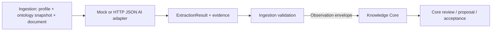

# AI and extraction boundary

AI adapters live in Andromeda Ingestion Platform, not in Knowledge Core. They
receive trusted extraction instructions, a versioned ontology snapshot and
untrusted prepared document chunks. They return strict candidate contracts with
confidence and evidence; they do not create canonical facts, activate rules or
mutate the ontology.

Knowledge Core only validates and persists the observation boundary and applies
its own ontology, provenance, review and canonical-knowledge policies. It has
no external AI credentials and no provider SDK dependency. The mock provider is
used in CI; a live provider is an optional Ingestion deployment concern.
