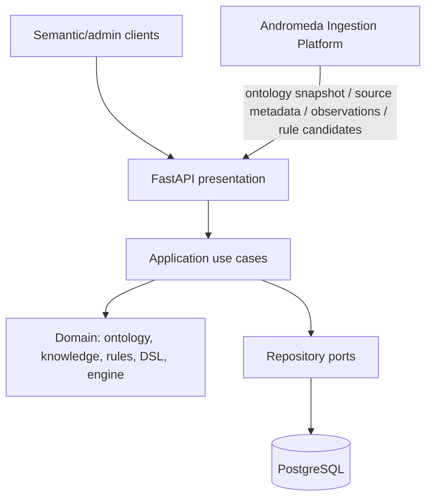

# Architecture

Andromeda Knowledge Core is an explicit-architecture modular monolith. Its
stable responsibility is semantic knowledge, not external document ingestion.

## Core modules

- ontology: versioned definitions and controlled evolution;
- knowledge: objects, sources, source-document metadata, observations, facts and
  relations;
- rules and engine: closed AST validation, activation and deterministic
  evaluation;
- provenance, review, audit, changes and derived-value invalidation;
- semantic API: consumer-facing evaluation, simulation, explanation and
  projections.

The Core domain does not import FastAPI, SQLAlchemy, HTTP clients, browser or
document parsers, external AI SDKs or ingestion pipeline classes. Infrastructure
contains only the persistence and operational adapters required by these Core
responsibilities. Ingestion is an external anti-corruption boundary reached by
stable HTTP contracts, never by shared ORM models or direct database access.

## Ownership rule

Ingestion owns discovery, fetching, raw bytes, preparation, AI extraction,
candidate validation, refresh/retry orchestration and its own operational
metadata. Core owns ontology, canonical semantic records and decisions about
whether an incoming observation or rule candidate is mapped, reviewed or accepted. This means a
new source website or AI provider can be added without changing Core code.
