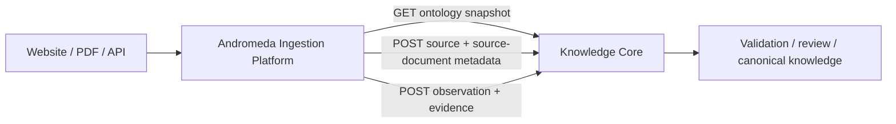

# Ingestion boundary

Knowledge Core does not fetch websites, parse PDFs/HTML, call an AI provider or
store raw bytes. Those responsibilities belong to the separate Andromeda
Ingestion Platform. Core receives typed source metadata and evidence-backed
observations through its HTTP API.

The ingestion service owns discovery, HTTP/browser/file fetchers, immutable raw
artifact storage, preparation, extraction profiles, AI adapters, validation,
candidate lifecycle, refresh/retry state and ingestion audit. Core owns
ontology, canonical objects, typed Facts/Relations/Rules, provenance,
review/activation, derived values and semantic queries.

## Core-facing contract

- `GET /api/v1/ontology/snapshot` returns the active ontology definitions and
  closed Rule DSL schema required by extraction and validation.
- `POST /api/v1/sources` registers the logical publisher/source identity.
- `POST /api/v1/source-documents` registers immutable document metadata keyed by
  `(source_id, document_checksum)`. The raw body remains in ingestion storage;
  `content_metadata` contains its artifact ID and storage reference.
- `POST /api/v1/observations` accepts an observation envelope containing
  `source_document_id`, candidate payload, evidence and idempotency headers.

Core never imports the ingestion repository, pipeline models, HTTP fetcher,
BeautifulSoup/pypdf, browser automation or an AI SDK. A website change or AI
provider change is therefore implemented in Ingestion adapters and does not
require a Core change.
